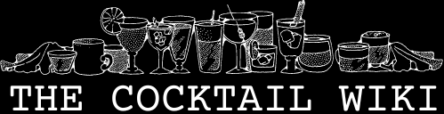

# CocktailWiki

## Demo

Check out a demo of the project <a href="http://scary-glass.surge.sh/" target="_blank">here</a>

## Tech Stack

### Frontend

React  
MaterialUI

### Backend

Node.js 
Express 
Postgres 
Sequelize

### Deployment

Docker 
Docker Compose 
AWS (EC2)

## Installation

$ git clone https://github.com/DanielHong95/cocktailwiki.git

### Frontend Installation

$ cd cocktail-wiki/frontend
$ npm install

### Backend Installation

- $ cd cocktail-wiki/server
- $ npm install

## Running the Project

### Running the Frontend

- $ cd cocktail-wiki/frontend
- $ npm start

### Running the Backend

- $ cd cocktail-wiki/server
- $ npm install -g nodemon
- $ nodemon start
